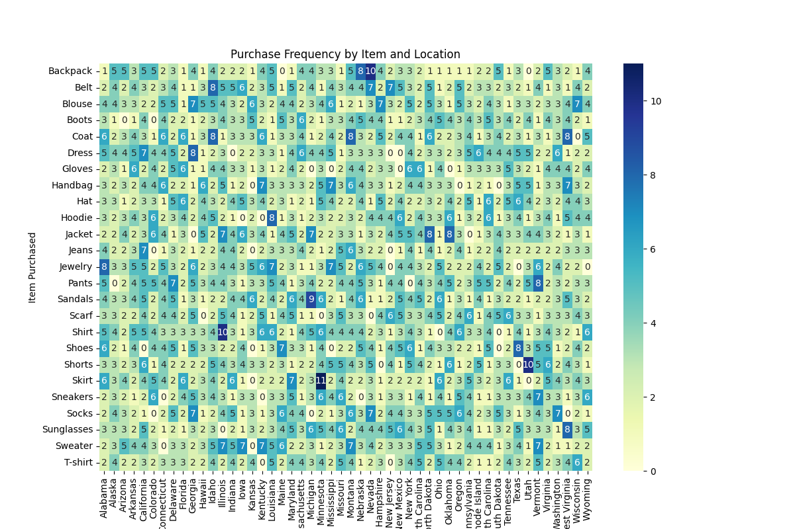
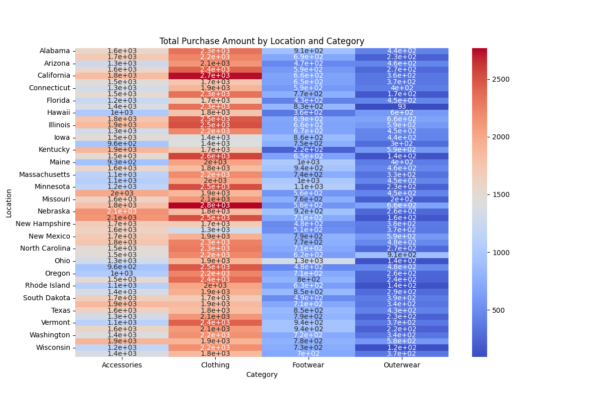

# Customer Purchase Heatmap Analysis

## Overview

This project performs a detailed heatmap analysis of customer purchase data to reveal patterns and trends. The analysis uses Python libraries to visualize data and provide actionable insights for marketing strategies.

## Project Structure

- **`data/`**: Contains the raw data file.
- **`notebooks/`**: Jupyter notebook for data processing and visualization.
- **`visuals/`**: Generated heatmap images.
- **`README.md`**: Overview and instructions for the project.
- **`requirements.txt`**: List of dependencies.

## Visualizations

- **Heatmap 1:** 
- **Heatmap 2:** 
- **Heatmap 3:** 


## Installation

1. **Clone the Repository:**
   ```bash
   git clone https://github.com/your-username/customer-purchase-heatmap-analysis.git


